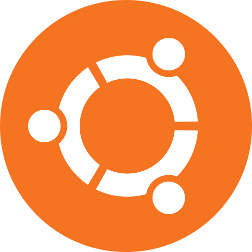
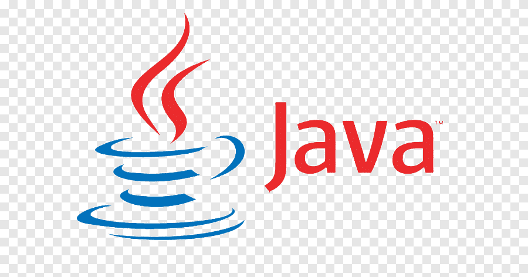

### Hi, I'm Wendell Alves 😊️

## Currently, I code more Java and JavaScript stuff

- 🔭 I’m currently interested on  [VS Code Course][website]!
- 🌱 I’m currently learning everything 🤣
- 👯 I’m looking to collaborate with other content creators
- 🥅 2020 Goals: Contribute more to Open Source projects
- ⚡ Fun fact: I love to draw and play guitar / drums

### My Spotify ❤️🎧

 

### Languages and Tools:

[][VS]
[][HTML5]
[][CSS3]
[][SASS]
[][JS]
[][NODE]
[][SQL]
[][GIT]
[][GITHUB]
[][TERMINAL]
[][UBUNTU]
[][POSTGRESQL]
[][JAVA]
[][SPRING]

